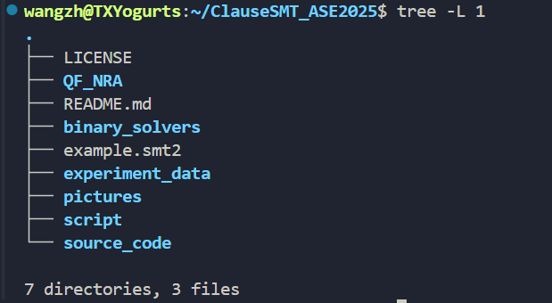
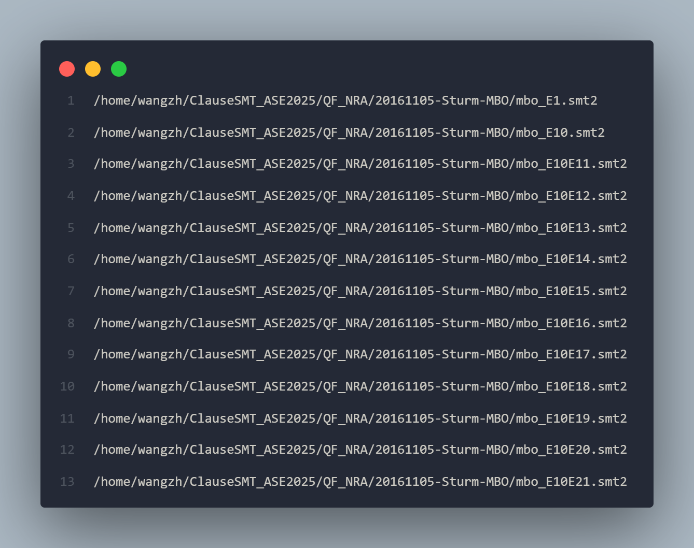

# Artefact of "ClauseSMT: Clause Level NLSAT for Nonlinear Real Arithmetic"

Author: Zhonghan Wang (wangzh@ios.ac.cn)

## Structure of the Artefact
1. **binary_solvers:** The pre-compiled binary files of different versions of our solver and other existing solvers.
2. **experiment_data:** Our experimental results on the QF_NRA benchmark.
3. **script:** The scripts for generating the file path list and running the experiments.
4. **source_code:** The source code of different versions of our solver.
5. **paper.pdf:** The research paper.
6. **README:** This file.
7. **LICENSE.txt:** The license of the artefact.

## 0. Environment Dependencies
We recommend the user to conduct the experiment on **Linux or Windows WSL**.

To fully reproduce our experimental results, we highly recommend the user to get an external server for the parallel computing usage.

Besides, several dependencies shown below are required:
1. AR archiving tool
2. Python
3. G++, or other C++ compilers like Clang

## 1. Download Benchmark
We provide the benchmark in our Google drive link
https://drive.google.com/file/d/1Nc7IQEeeTFXFdrrVp6pKLkMbwv7ISc99/view?usp=sharing

One should unzip the file to get the `QF_NRA` directory.

```
unzip QF_NRA.zip
```
After this step, the folder structure should look like this:


## 2. Generate File Path List
To fully evaluate our solver on the whole benchmark, we should generate the absolute paths for all instances.

```
cd script
python generate_list.py ../QF_NRA/
```
The generated absolute paths are stored in `QF_NRA/list.txt` with 12134 lines.


## 3. Compilation and Binary Files
There are two ways to use our smt solver, either compile the source code or just use the binary files.
### 3.1 Compilation from Source Code
To compile the source code, we provide a script `script/mk_make.py` to generate the makefile and compile the source code.

```
cd source_code/clauseSMT
python scripts/mk_make.py
cd build
make -j <thread_num>
```
After this, a binary file `z3` will be generated in the `build` directory.

### 3.2 Binary Files
We also provide the pre-compiled binary files of our solver and other SMT solvers in `binary_solvers/`.

### 3.3 Test the Binary Files
We provide a simple smt instance `example.smt2` for testing the binary files.
1. Compiled Binary Files
```
./source_code/clauseSMT/build/z3 example.smt2
```
2. Pre-compiled Binary Files
```
./binary_solvers/clauseSMT example.smt2
```

## 4. Run clauseSMT on the Benchmark
To fully get the experimental results, we provide a script `script/parallel_run.cpp` to run our solver on all instances in the benchmark with multiple threads. We strongly recommend the user to **use an external server** for the parallel computing usage.

```
mkdir self_data
cd script
g++ -O3 -o parallel_run parallel_run.cpp
./parallel_run [instance_list_path] [solver_path] [output_path] [time_limit] [memory_limit] [max_process_num]
```
where `instance_list_path` is the path to the list file of test cases, `solver_path` is the path to the solver binary file, `output_path` is the path to collect the results, `time_limit` is the time limit (seconds) for each instance, `memory_limit` is the memory limit (MB) for each instance, and `max_process_num` is the maximum number of processes to run in parallel.

A recommended setting for the external server is:
```
./parallel_run ../QF_NRA/list.txt ../source_code/clauseSMT/build/z3 ../self_data/ 1200 30720 120
```
or 
```
./parallel_run ../QF_NRA/list.txt ../binary_solvers/clauseSMT ../self_data/ 1200 30720 120
```
if your would like to use the pre-compiled binary files.

In SMT-COMP, the standard timelimit is 1200 seconds and the memory limit is 30720 MB for each instance.

If the user can not get an advanced external server and would like to narrow the test set, please manually modify the `instance_list_path` to a smaller list files containing a subset of the benchmark.

If everything goes well, the `self_data` folder would contain txt files for each instance, each containing the solver's output and statistics.



## 5. Collecting Results
We provide a script `script/collect.py` to collect the results of all solvers on all test cases, and generate a csv file. The script takes two arguments:

+ **folder_path:** the path to the folder containing the results (for example: `../self_data/`)
+ **output_file:** the path to the output csv file (for example: `csv/clauseSMT.csv`)

```
mkdir csv
cd script
python collect.py ../self_data/ csv/clauseSMT.csv
```
Then the `csv/clauseSMT.csv` file would contain the results of our solver on all test cases, including the instance name, solver's output, time and memory consumption.


## 6. Comparison with our results
We provide the experimental results of our solver on the whole benchmark in `experiment_data/`. The user can compare their results with ours to see the performance of our solver.

## 7. Other SMT Solvers
We also provide the source code and binary files of other SMT solvers, including NLSAT, Z3, CVC5, Yices2, dReal, and MathSAT. The user can use these solvers to compare their results with ours, following the steps in the previous sections.


## Appendix: Description of Solvers and Experimental Results
#### Comparison with Existing SMT Solvers
| Solver | Path | Data | Usage | Sat | Unsat | Solved |
| --- | --- | --- | --- | --- | --- | --- |
| NLSAT | [NLSAT](solvers/NLSAT) | [NLSAT_result](data/NLSAT.csv) | ./NLSAT <*.smt2> | 5541 | 5191 | 10732|
| Z3 | [z3](solvers/z3) | [z3_result](data/z3.csv) | ./z3 <*.smt2> | 5569 | 5379 | 10948|
| CVC5 | [cvc5](solvers/cvc5) | [cvc5_result](data/cvc5.csv) | ./cvc5 <*.smt2> | 5475 | 5809 | 11284|
| Yices2 | [yices2](solvers/yices2) | [yices2_result](data/yices2.csv) | ./yices2 <*.smt2> | 5372 | 5612 | 10984|
| dReal (delta=0.001) | [dReal](solvers/dReal) | [dReal_result](data/dReal.csv) | ./dReal --precision 0.001 <*.smt2> | 4811 | 4294 | 9105|
| MathSAT | [mathsat](solvers/mathsat) | [mathsat_result](data/mathsat.csv) | ./mathsat <*.smt2> | 2772 | 4583 | 7355|
| clauseSMT (Ours) | [clauseSMT](solvers/clauseSMT) | [clauseSMT_result](data/clauseSMT.csv) | ./clauseSMT <*.smt2> | 5608 | 5397 | 11005 |

#### Effect of Proposed Techniques (Ablation Study)
##### Effect of Look-Ahead Mechanism
| Solver | Description | Path | Data | Usage | Sat | Unsat | Solved |
| --- | --- | --- | --- | --- | --- | --- | --- |
| NLSAT | Decide Lowest Degree Literal | [NLSAT](solvers/NLSAT) | [NLSAT_result](data/NLSAT.csv) | ./NLSAT <*.smt2> -st | 5541 | 5191 | 10732|
| random_decide | Decide Random Literal | [random_decide](solvers/random_decide) | [random_decide_result](data/random_decide.csv) | ./random_decide <*.smt2> -st | 5505 | 5147 | 10652|
| static-look-ahead | Feasible-set based Look-Ahead | [static-look-ahead](solvers/static-look-ahead) | [static-look-ahead_result](data/static-look-ahead.csv) | ./static-look-ahead <*.smt2> -st | 5555 | 5223 | 10778|

##### Effect of Clause-Level Propagation based Branching Heuristic
| Solver | Description | Path | Data | Usage | Sat | Unsat | Solved |
| --- | --- | --- | --- | --- | --- | --- | --- |
| static-look-ahead | Static order based on degree | [static-look-ahead](solvers/static-look-ahead) | [static-look-ahead_result](data/static-look-ahead.csv) | ./static-look-ahead <*.smt2> -st | 5555 | 5223 | 10778|
| vsids-look-ahead | Dynamic order based on VSIDS | [vsids-look-ahead](solvers/vsids-look-ahead) | [vsids-look-ahead_result](data/vsids-look-ahead.csv) | ./vsids-look-ahead <*.smt2> -st | 5599 | 5321 | 10920|
| clauseSMT (Ours) | Dynamic order based on clause-level propagation | [clauseSMT](solvers/clauseSMT) | [clauseSMT_result](data/clauseSMT.csv) | ./clauseSMT <*.smt2> -st | 5608 | 5397 | 11005|
